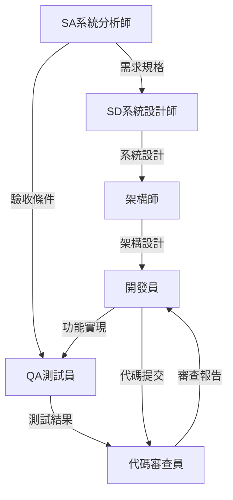

# 角色行動模式 (Role Action Patterns)

## 概述

角色行動模式定義每個技術角色的專屬工作模式和最佳實踐。每個角色在遵循公共行動模式的基礎上，還需要執行其專業領域的特定行動模式。

---

## 🏗️ 架構師 (Architect) 行動模式

### 專業行動流程

**1. 架構規劃階段**
```yaml
planning_actions:
  - 業務需求技術轉換
  - 非功能需求識別
  - 架構風格選擇評估
  - 技術棧兼容性分析
  - 擴展性與維護性設計

deliverables:
  - 架構決策記錄 (ADR)
  - 技術選型報告
  - 系統架構圖
  - 部署架構圖
```

**2. 架構設計執行**
```yaml
execution_actions:
  - Spring Boot模組架構設計
  - 微服務邊界劃分
  - API契約設計
  - 資料庫架構設計
  - 安全架構規劃
  - 監控與日誌策略

quality_gates:
  - 架構一致性檢查
  - 性能瓶頸預防
  - 安全漏洞評估
  - 可擴展性驗證
```

**3. 架構治理報告**
```yaml
reporting_focus:
  - 架構合規性分析
  - 技術債務評估
  - 架構演進建議
  - 團隊技術能力評估
```

### 架構師專屬模板

```markdown
# 架構設計報告 - {系統名稱}

## 🏛️ 架構總覽
- **架構風格**: {分層架構/微服務/事件驅動}
- **技術棧**: Spring Boot {版本} + {相關技術}
- **部署模式**: {單體/微服務/容器化}

## 📊 架構決策記錄 (ADR)
| 決策ID | 決策內容 | 驅動因素 | 替代方案 | 狀態 |
|--------|----------|----------|----------|------|
| ADR-001 | {決策1} | {原因} | {替代方案} | {已採納/已拒絕} |

## 🔧 技術選型分析
### 採用技術評估
- **Spring Boot**: ✅ 符合團隊技能、生態成熟
- **JPA/Hibernate**: ✅ ORM標準、Spring整合良好
- **H2/MySQL**: ✅ 開發測試便利、生產可靠

### 風險與對策
- **技術風險**: {風險描述} → {應對策略}
- **團隊風險**: {風險描述} → {應對策略}
```

---

## 👨‍💻 開發員 (Developer) 行動模式

### 專業行動流程

**1. 編碼規劃階段**
```yaml
planning_actions:
  - 功能需求分解
  - 接口設計確認
  - 資料結構設計
  - 單元測試計劃
  - 第三方依賴評估

code_standards:
  - Google Java Style Guide
  - Spring Boot Best Practices
  - RESTful API Design Guidelines
```

**2. 編碼執行階段**
```yaml
execution_actions:
  - TDD紅綠重構循環
  - Spring Boot組件開發
  - RESTful API實作
  - JPA實體與Repository
  - 異常處理與驗證
  - 單元測試編寫

daily_checklist:
  - [ ] 代碼符合Google Java Style
  - [ ] 單元測試覆蓋率>80%
  - [ ] API文檔同步更新
  - [ ] 異常處理完整
  - [ ] 日誌記錄適當
```

**3. 代碼交付報告**
```yaml
reporting_focus:
  - 功能實現完成度
  - 代碼品質指標
  - 測試覆蓋率統計
  - 性能基準測試
  - 已知問題清單
```

### 開發員專屬模板

```markdown
# 功能開發報告 - {功能名稱}

## 💻 實現總結
- **開發語言**: Java 17
- **框架版本**: Spring Boot 3.2.0
- **實現模式**: {MVC/分層架構/等}
- **代碼行數**: {有效代碼行數}

## 🔨 技術實現
### 核心組件
1. **Controller**: {控制器說明}
   ```java
   @RestController
   @RequestMapping("/api/exchange-rates")
   public class ExchangeRateController {
       // 實現細節
   }
   ```

2. **Service**: {業務邏輯說明}
3. **Repository**: {資料存取說明}

### API端點
| HTTP Method | Endpoint | 功能 | 狀態 |
|-------------|----------|------|------|
| GET | `/api/exchange-rates` | 查詢匯率 | ✅ 已完成 |
| POST | `/api/exchange-rates` | 新增匯率 | ✅ 已完成 |

## 🧪 測試結果
- **單元測試**: {通過數}/{總數} ({覆蓋率}%)
- **整合測試**: {通過數}/{總數}
- **性能測試**: 平均回應時間 {時間}ms

## 🐛 已知問題
- {問題1}: {影響} → {計劃解決時間}
- {問題2}: {影響} → {計劃解決時間}
```

---

## 🧪 QA測試員 (QA Tester) 行動模式

### 專業行動流程

**1. 測試規劃階段**
```yaml
planning_actions:
  - 測試需求分析
  - 測試場景設計
  - Gherkin規格撰寫
  - 測試數據準備
  - 自動化策略制定

test_types:
  - 功能測試 (Functional)
  - 整合測試 (Integration)  
  - API測試 (REST Assured)
  - 性能測試 (Performance)
  - 安全測試 (Security)
```

**2. 測試執行階段**
```yaml
execution_actions:
  - Cucumber BDD測試執行
  - JUnit 5單元測試驗證
  - REST Assured API測試
  - 回歸測試執行
  - 缺陷發現與記錄
  - 測試覆蓋率分析

automation_focus:
  - Cucumber步驟定義維護
  - 測試數據管理
  - CI/CD整合測試
```

**3. 測試報告階段**
```yaml
reporting_focus:
  - 測試執行統計
  - 缺陷統計分析
  - 品質趨勢分析
  - 自動化覆蓋率
  - 測試改進建議
```

### QA測試員專屬模板

```markdown
# 測試執行報告 - {測試週期}

## 🎯 測試總覽
- **測試範圍**: {測試範圍說明}
- **測試環境**: Spring Boot Test + H2
- **執行時間**: {開始時間} ~ {結束時間}
- **測試策略**: BDD + Unit + Integration

## 📊 執行統計
### BDD測試 (Cucumber)
- **Feature檔案**: {檔案數}
- **測試場景**: {總場景數}
    - ✅ 通過: {通過數} ({通過率}%)
    - ❌ 失敗: {失敗數}
    - ⏸️ 跳過: {跳過數}

### 測試分類統計
| 測試類型 | 執行數 | 通過數 | 失敗數 | 通過率 |
|---------|-------|-------|-------|--------|
| @happy-path | {數量} | {通過} | {失敗} |  |
| @edge-case | {數量} | {通過} | {失敗} | {%} |

## 🐛 缺陷分析
### 新發現缺陷
| 缺陷ID | 描述 | 嚴重程度 | 狀態 | 負責人 |
|--------|------|----------|------|--------|
| BUG-001 | {缺陷描述} | {High/Medium/Low} | {Open/Fixed} | {開發員} |

### 品質門禁
- [ ] 功能測試通過率 ≥ 95%
- [ ] 自動化測試覆蓋率 ≥ 80%
- [ ] 無高嚴重度缺陷
- [ ] 無安全漏洞
```

---

## 🔍 代碼審查員 (Code Reviewer) 行動模式

### 專業行動流程

**1. 審查規劃階段**
```yaml
planning_actions:
  - 審查範圍確認
  - 審查標準制定
  - 檢查清單準備
  - 工具配置確認

review_criteria:
  - Spring Boot最佳實踐
  - Google Java Style Guide
  - 安全編碼規範
  - 性能優化原則
```

**2. 審查執行階段**
```yaml
execution_actions:
  - 代碼風格檢查
  - 架構一致性驗證
  - 安全漏洞掃描
  - 性能問題識別
  - 單元測試質量評估
  - 文檔完整性檢查

review_tools:
  - SonarQube靜態檢查
  - SpotBugs安全掃描
  - JaCoCo覆蓋率分析
  - GitHub PR Review
```

**3. 審查結果報告**
```yaml
reporting_focus:
  - 代碼品質評分
  - 問題分類統計
  - 改進建議清單
  - 團隊培訓需求
```

---

## 📊 SA系統分析師 (System Analyst) 行動模式

### 專業行動流程

**1. 需求分析階段**
```yaml
planning_actions:
  - 業務需求收集
  - 利害關係人訪談
  - 用例場景分析
  - 驗收條件定義
  - 風險與約束識別
```

**2. 規格撰寫階段**
```yaml
execution_actions:
  - 需求文檔撰寫
  - Gherkin規格制定
  - 用例圖繪製
  - 流程圖設計
  - 資料流分析
  - 與QA協作定義測試場景
```

**3. 驗證與確認階段**
```yaml
reporting_focus:
  - 需求覆蓋度分析
  - 利害關係人確認
  - 可追溯性矩陣
  - 變更影響評估
```

---

## 📐 SD系統設計師 (System Designer) 行動模式

### 專業行動流程

**1. 設計規劃階段**
```yaml
planning_actions:
  - 需求分析理解
  - 設計約束識別
  - 設計模式選擇
  - 介面規範制定
```

**2. 設計執行階段**
```yaml
execution_actions:
  - 高階設計(HLD)
  - 詳細設計(LLD)
  - 資料庫設計
  - API規格設計
  - 介面設計規範
  - 系統整合設計
```

**3. 設計交付階段**
```yaml
reporting_focus:
  - 設計文檔完整性
  - 設計合理性評估
  - 可實現性驗證
  - 後續維護考量
```

---

## 🔄 角色間協作模式

### 工作流程整合


### 協作檢查點
```yaml
collaboration_checkpoints:
  requirements_review:
    participants: [SA, SD, 架構師, QA]
    deliverable: 需求確認書

  design_review:
    participants: [SD, 架構師, 開發員]
    deliverable: 設計確認書

  code_review:
    participants: [開發員, 代碼審查員, QA]
    deliverable: 代碼審查報告

  acceptance_review:
    participants: [SA, QA, 架構師]
    deliverable: 驗收報告
```

**重要提醒**: 每個角色都應該熟練掌握自己的專業行動模式，同時與其他角色保持良好協作。