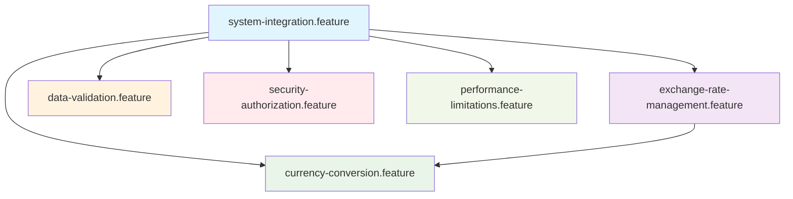

# Feature檔案組織架構

本專案的BDD測試採用業務域導向的feature檔案組織方式，將原本單一的大型feature檔案拆分為多個專業領域的小型檔案。

## 📁 檔案結構

```
features/
├── README.md                           # 本說明文件
├── system-integration.feature          # 系統整合基礎功能
├── exchange-rate-management.feature    # 匯率資料管理 (CRUD)
├── currency-conversion.feature         # 貨幣換算服務
├── data-validation.feature            # 資料驗證與業務規則
├── security-authorization.feature      # 安全認證與權限控制
├── performance-limitations.feature     # 系統效能與限制
└── exchange-rate-api.feature          # 原始檔案 (已廢棄，保留作參考)
```

## 🎯 各檔案功能說明

### 1. `system-integration.feature`
**系統整合基礎功能**
- 系統健康檢查
- 資料庫連線測試
- 基礎環境驗證
- **標籤**: `@smoke`, `@integration`

### 2. `exchange-rate-management.feature`  
**匯率資料管理 (CRUD操作)**
- 新增匯率資料 (`@create`)
- 查詢匯率資料 (`@read`)
- 更新匯率資料 (`@update`)
- 刪除匯率資料 (`@delete`)
- **標籤**: `@exchange-rate-management`, `@happy-path`, `@edge-case`

### 3. `currency-conversion.feature`
**貨幣換算服務**
- 直接換算 (`@direct-conversion`)
- 反向換算 (`@reverse-conversion`)
- 鏈式換算 (`@multi-step-conversion`)
- 換算錯誤處理 (`@no-rate-available`)
- **標籤**: `@conversion`, `@chain`

### 4. `data-validation.feature`
**資料驗證與業務規則**
- 輸入驗證 (`@input-validation`)
- 業務規則檢查 (`@business-rule`)
- 資料正規化 (`@normalization`)
- 資料完整性 (`@data-integrity`)
- **標籤**: `@validation`

### 5. `security-authorization.feature`
**安全認證與權限控制**
- 身份認證 (`@authentication`)
- 權限授權 (`@authorization`)
- 角色基礎訪問控制 (`@rbac`)
- 安全審計 (`@audit`)
- **標籤**: `@security`

### 6. `performance-limitations.feature`
**系統效能與限制**
- API頻率限制 (`@rate-limit`)
- 分頁查詢 (`@pagination`)
- 響應時間要求 (`@response-time`)
- 併發處理 (`@concurrency`)
- **標籤**: `@performance`

## 🏷️ 標籤分類系統

### 功能分類標籤
- `@create` - 建立操作
- `@read` - 讀取操作  
- `@update` - 更新操作
- `@delete` - 刪除操作
- `@conversion` - 貨幣換算

### 測試類型標籤
- `@smoke` - 煙霧測試 (基本功能驗證)
- `@happy-path` - 正常流程測試
- `@edge-case` - 邊界條件測試
- `@validation` - 驗證測試

### 業務領域標籤
- `@exchange-rate-management` - 匯率管理
- `@security` - 安全相關
- `@performance` - 效能相關
- `@integration` - 整合測試

## 🔗 檔案間依賴關係



### 執行順序建議
1. **system-integration.feature** - 首先執行，確保基礎環境正常
2. **exchange-rate-management.feature** - 核心CRUD功能
3. **currency-conversion.feature** - 依賴匯率資料的換算功能
4. **data-validation.feature** - 可與其他功能並行執行
5. **security-authorization.feature** - 安全測試，可獨立執行
6. **performance-limitations.feature** - 效能測試，通常最後執行

## 🚀 執行命令範例

### 執行特定業務域測試
```bash
# 只執行匯率管理相關測試
mvn test -Dtest=CucumberTestRunner -Dcucumber.filter.tags="@exchange-rate-management"

# 只執行安全相關測試
mvn test -Dtest=CucumberTestRunner -Dcucumber.filter.tags="@security"

# 執行煙霧測試
mvn test -Dtest=CucumberTestRunner -Dcucumber.filter.tags="@smoke"
```

### 執行組合測試
```bash
# 執行所有正常流程測試
mvn test -Dtest=CucumberTestRunner -Dcucumber.filter.tags="@happy-path"

# 執行CRUD操作測試
mvn test -Dtest=CucumberTestRunner -Dcucumber.filter.tags="@create or @read or @update or @delete"

# 排除效能測試
mvn test -Dtest=CucumberTestRunner -Dcucumber.filter.tags="not @performance"
```

## 📊 測試覆蓋度統計

| 業務域 | 測試場景數 | 覆蓋功能 | 優先級 |
|--------|-----------|----------|--------|
| 系統整合 | 2 | 基礎環境 | 高 |
| 匯率管理 | 10 | CRUD操作 | 高 |
| 貨幣換算 | 4 | 換算服務 | 高 |
| 資料驗證 | 8 | 驗證規則 | 中 |
| 安全權限 | 8 | 安全控制 | 中 |
| 效能限制 | 12 | 效能要求 | 低 |

## 🔧 維護指南

### 新增測試場景
1. 識別場景所屬的業務域
2. 選擇對應的feature檔案
3. 使用適當的標籤標記
4. 遵循現有的命名規範

### 修改現有測試
1. 確保修改不影響其他相依測試
2. 更新相關的標籤和分類
3. 檢查是否需要同步更新其他檔案

### 重構建議
- 當單一feature檔案超過20個scenario時，考慮進一步拆分
- 定期檢查標籤使用情況，移除未使用的標籤
- 保持Business Language的一致性